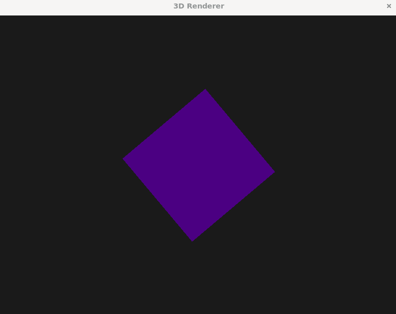
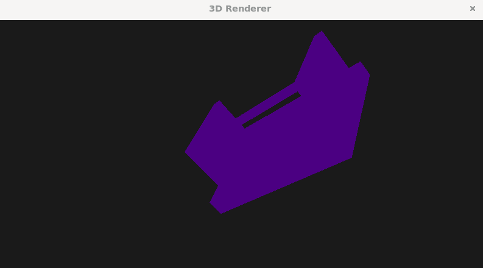

# 🧭 OpenGL 3D Renderer 

**C++ OpenGL rendering framework** built with opengl.

---

## Clone the Project

> **⚠️ Recommendation:** It is recommended to run this demo on **Linux** or **WSL** for best compatibility with OpenGL and GLFW.

### 1️⃣ Install Required Tools

Before running the demo, make sure you have **CMake**, **g++**, and required development tools installed. On Ubuntu/Debian, you can install them with:

---

```bash
sudo apt update
sudo apt install -y build-essential cmake git
# Clone the repository
git clone https://github.com/YassineM0/3D-Rendering-engine.git

# Navigate to the cube demo folder
cd 3D-Rendering-engine/demo/cube

# Create a build directory
mkdir build && cd build

# Generate build files with CMake
cmake ..

# Build the demo
cmake --build .

```

---

## 🏃‍♂️ Run the demo

```bash
cd demos

#cube demo
cd cube

cd build

# Generate build files with CMake
cmake ..

# Build the demo
cmake --build .

# Run the cube EXE
./cube_demo


```



## Step files importing

This renderer supports **loading and visualizing any STEP (.stp/.step) 3D model** using **OpenCascade**.  

**Tip:** Ensure your STEP file is properly exported from your CAD software to avoid import issues.
>> place your step file in the sample_step_files folder
>> if object too big or too small adjust camera position in constructor or move the camera using (Q, W, S, D) buttons or adjust scaling in Renderer::render()

```bash
cd demos

# Generate build files with CMake
cmake ..

# Build the demo
cmake --build .

./3D_Rendering_Engine

```





## 🧰 Tech Stack

| Component | Library |
|------------|----------|
| Windowing & Input | [GLFW](https://www.glfw.org/) |
| OpenGL Loader | [GLAD](https://glad.dav1d.de/) |
| Math Library | [GLM](https://github.com/g-truc/glm) |
| Image Loading | [stb_image.h](https://github.com/nothings/stb) |
| File Format | STEP (.stp) support |
| Shaders | GLSL |

---

## 🧠 Project Structure

